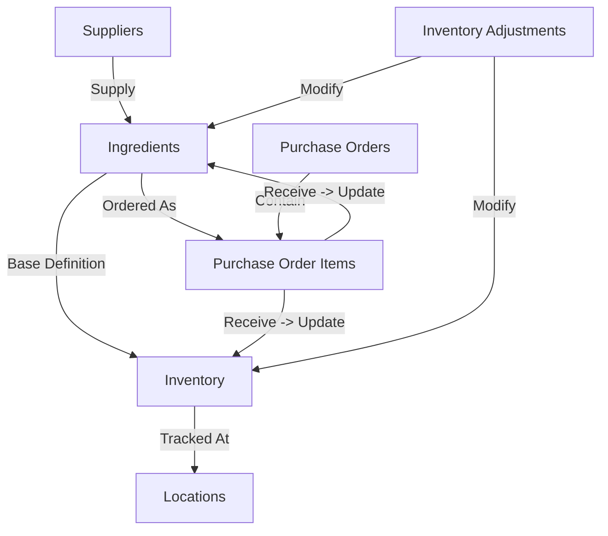

# Inventory & Procurement System Architecture

This document explains the relationships and data flow between Suppliers, Ingredients, Inventory, Purchase Orders, and Adjustments.

## Entity Relationships

## 1. Suppliers
- **Purpose**: Manage vendor information.
- **Relation**: Suppliers are linked to Ingredients. An ingredient can have a preferred supplier.
- **Data Flow**: When creating a Purchase Order, you select a Supplier, which filters the available Ingredients to order (optional, but good practice).

## 2. Ingredients (Catalog)
- **Purpose**: The master catalog of all items that can be purchased or stocked.
- **Key Data**: 
  - `current_stock`: The **global** total quantity of this ingredient across all locations.
  - `cost_per_unit`: Used for valuation.
  - `reorder_point`: Triggers low stock alerts.
- **Relation**: Acts as the "Product Definition".

## 3. Purchase Orders (Procurement)
- **Purpose**: To order more stock from Suppliers.
- **Workflow**:
  1. **Create PO**: Select Supplier and add Ingredients as items. Status: `draft` -> `pending`.
  2. **Approve**: Manager approves the PO. Status: `approved`.
  3. **Order**: PO is sent to supplier. Status: `ordered`.
  4. **Receive**: When goods arrive, you "Receive" items.
     - **CRITICAL ACTION**: Receiving items triggers updates to:
       - `Inventory` table: Increases stock at the specific Location.
       - `Ingredients` table: Increases global `current_stock`.
       - `InventoryTransactions`: Records the "purchase_received" event.

## 4. Inventory (Stock at Locations)
- **Purpose**: Tracks how much of an Ingredient is at a specific Location (e.g., Kitchen, Warehouse).
- **Key Data**: `quantity`, `location_id`, `ingredient_id`.
- **Relation**: This is the physical stock. 
  - `Sum(Inventory.quantity)` should ideally equal `Ingredient.current_stock`.

## 5. Inventory Adjustments (Corrections)
- **Purpose**: To manually fix stock counts (e.g., wastage, theft, spoilage, counting errors).
- **Workflow**:
  1. **Create Adjustment**: Employee reports a discrepancy. Status: `pending`.
  2. **Approve/Reject**: Manager reviews.
  3. **Effect**: Upon approval:
     - Updates `Inventory` quantity at that location.
     - Updates `Ingredient` global `current_stock`.
     - Creates an `InventoryTransaction` record.

## 6. Inventory Transactions (Audit Trail)
- **Purpose**: A history of every stock movement.
- **Types**: 
  - `purchase_received` (from PO)
  - `transfer_in` / `transfer_out` (between locations)
  - `wastage` (recorded directly)
  - `adjustment` (from Inventory Adjustments)

## Data Flow Summary

| Action | Updates Inventory (Location) | Updates Ingredient (Global) | Creates Transaction |
|--------|------------------------------|-----------------------------|---------------------|
| **Receive PO** | ✅ Yes (Increments) | ✅ Yes (Increments) | ✅ Yes (purchase_received) |
| **Transfer** | ✅ Yes (Move) | ❌ No (Net change 0) | ✅ Yes (transfer_in/out) |
| **Wastage** | ✅ Yes (Decrements) | ✅ Yes (Decrements) | ✅ Yes (wastage) |
| **Adjustment** | ✅ Yes (+/-) | ✅ Yes (+/-) | ✅ Yes (adjustment) |
